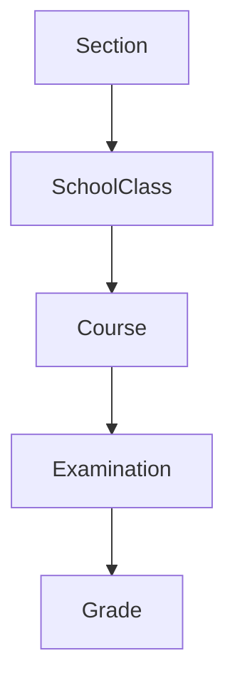

# Database Migration Documentation

## Overview
This document explains the database migration process for the school management system, detailing the changes made to align Rails migrations with the SQL schema while maintaining data integrity and relationships.

## Initial Structure Issues

### SQL Schema (Original Reference)
```sql
create table if not exists classes (
    id         int auto_increment
        primary key,
    section_id int          not null,
    # ... other fields
);
```

### Rails Initial State
```ruby
# Initial problematic structure
create_table :school_classes do |t|  # Different naming
  # Missing section_id
end

create_table :courses do |t|
  t.references :classe  # Incorrect reference
end
```

## Migration Sequence

### 1. Base Authentication (`20250306131116_devise_create_people.rb`)
- Creates people table with Devise authentication
- Includes profile fields (username, firstname, lastname)
- Supports STI for different user types (Student, Teacher, Dean)

### 2. Core Entities
- **Addresses** (`20250306131153_create_addresses.rb`): Location information
- **Rooms** (`20250306131156_create_rooms.rb`): Physical classroom spaces
- **Moments** (`20250306131159_create_moments.rb`): Time slots and scheduling

### 3. Academic Structure
- **SchoolClasses** (`20250306131202_create_school_classes.rb`): Class organization
- **Subjects** (`20250306131205_create_subjects.rb`): Academic subjects
- **Courses** (`20250306131208_create_courses.rb`): Course scheduling and management
- **Examinations** (`20250306131211_create_examinations.rb`): Test scheduling
- **Grades** (`20250306131642_create_grades.rb`): Student performance tracking

### 4. Supporting Entities
- **Statuses** (`20250306142159_create_statuses.rb`): Status management
- **Sections** (`20250306142309_create_sections.rb`): Academic sections

## Fix Implementation

### The Fix Migration (`20250312202431_fix_course_class_reference.rb`)
```ruby
def change
  # Step 1: Fix course-to-class relationship
  remove_reference :courses, :classe
  add_reference :courses, :school_class, null: false, foreign_key: true
  
  # Step 2: Add section relationship
  add_reference :school_classes, :section, null: false, foreign_key: true
end
```

### Why Each Change Was Necessary

#### 1. Removing `classe` Reference
```ruby
remove_reference :courses, :classe
```
- Eliminates incorrect foreign key
- Prevents "table not found" errors
- Aligns with Rails naming conventions

#### 2. Adding `school_class` Reference
```ruby
add_reference :courses, :school_class
```
- Creates proper foreign key relationship
- Matches model naming convention
- Enables course-to-class associations

#### 3. Adding Section Reference
```ruby
add_reference :school_classes, :section
```
- Matches SQL schema requirements
- Resolves "Section must exist" validation
- Completes class-to-section relationship chain

## Model Updates

### Course Model Refinement
```ruby
class Course < ApplicationRecord
  belongs_to :school_class  # Updated reference
  has_many :sections       # Corrected association
  # ... other associations
end
```

## Data Flow


## Benefits of the Fix

### 1. Structural Integrity
- Aligned database with SQL schema
- Maintained Rails conventions
- Established proper foreign key relationships

### 2. Data Validation
- Ensures sections exist before class creation
- Validates all required relationships
- Maintains data integrity

### 3. Operational Improvements
- Enables proper data seeding
- Supports correct model associations
- Facilitates proper query relationships

## Seeding Order
1. Create sections
2. Create school classes (with section references)
3. Create courses (with school class references)
4. Add examinations and grades

## Conclusion
The migration fixes establish proper relationships while maintaining data integrity and Rails conventions. The changes ensure the application's database structure matches the original SQL schema requirements while supporting all necessary functionality. 