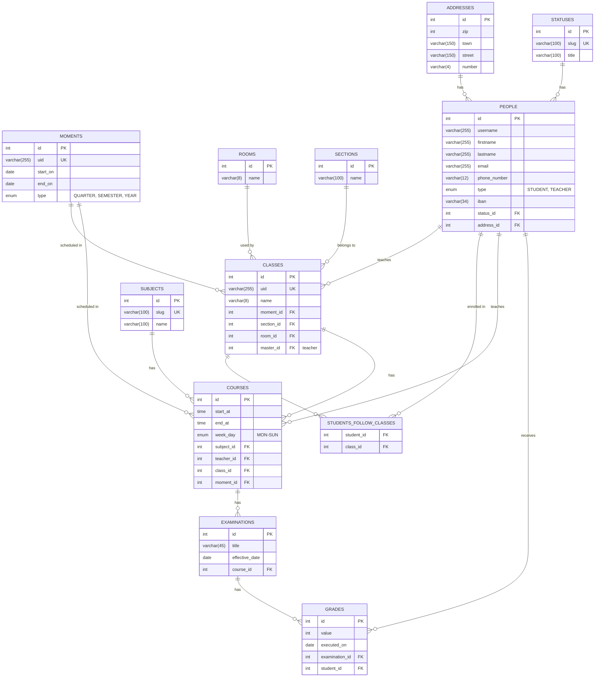
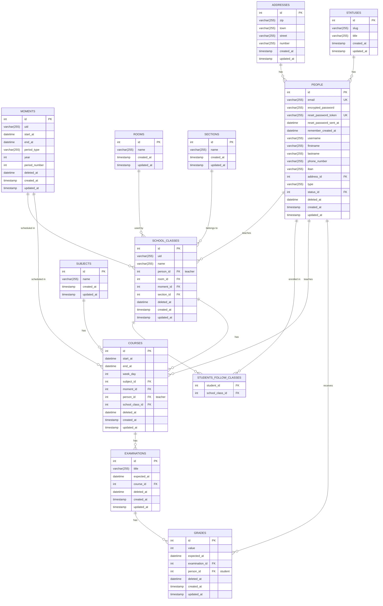

# Logical Data Model Comparison

This document presents a comparison between the logical data models of the original DBDRZ schema and the current implementation.

## Original DBDRZ Schema (LDM)

## Current Implementation Schema (LDM)

## Key Structural Differences in the LDM

1. **Entity Renaming**:
   - `CLASSES` → `SCHOOL_CLASSES` to avoid keyword conflicts

2. **Attribute Type Changes**:
   - Date fields → DateTime for more precise timestamp tracking
   - ENUMs → VARCHAR for greater flexibility and portability
   - Numeric fields → VARCHAR where needed (e.g., zip codes)

3. **New Attributes**:
   - Soft delete tracking (`deleted_at`) in most entities
   - Audit timestamps (`created_at`, `updated_at`) in all entities
   - Authentication fields in PEOPLE entity

4. **Relationship Changes**:
   - Foreign keys renamed for consistency (e.g., `teacher_id` → `person_id`)
   - Some nullable foreign keys made mandatory
   - Removal of explicit ON DELETE/UPDATE behaviors

5. **Constraint Changes**:
   - Relaxed NOT NULL constraints on many fields
   - Unique constraint changes (single fields vs. composite)
   - Added unique constraint on student-class association
